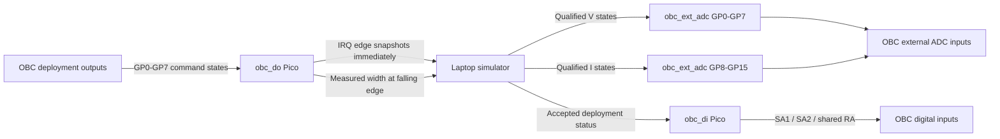
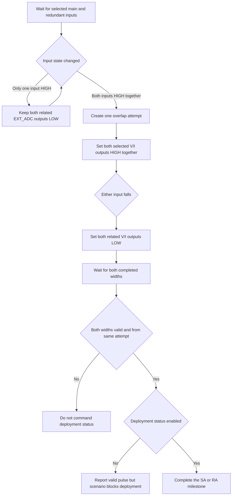
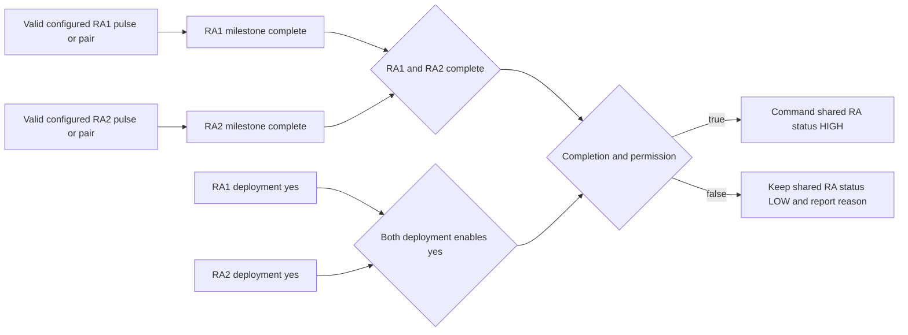
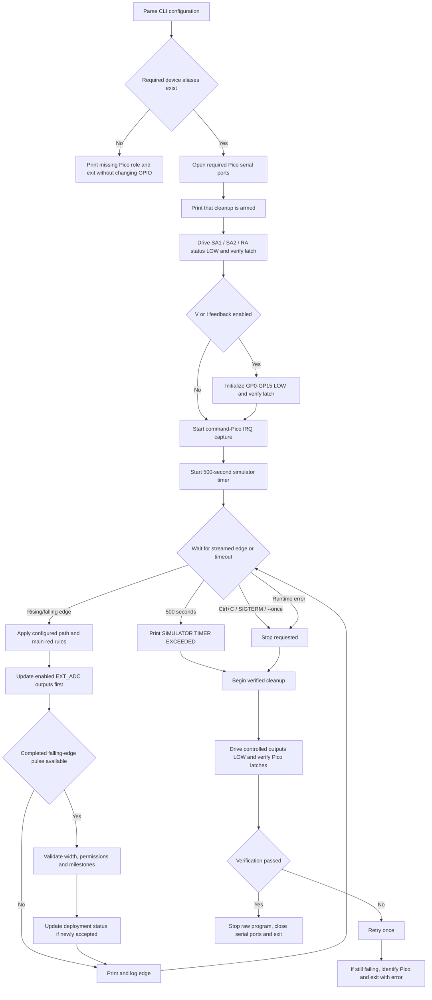

# SA/RA Deployment Simulator

`sara_deployment_sim.py` is a laptop-side HIL emulator for the OBC solar-array
(SA) and reflector-array (RA) deployment interfaces. It coordinates three
MicroPython Raspberry Pi Picos:

- `obc_do` observes the eight OBC deployment-command lines.
- `obc_ext_adc` reproduces qualified voltage/current channel states.
- `obc_di` drives the SA1, SA2 and shared RA deployment-status inputs.

The command Pico detects GPIO edges with interrupts and measures pulse widths
locally with `ticks_us()`. It streams rising and falling states immediately,
then includes the completed pulse width with the falling edge. The laptop does
not poll GPIO levels to measure the pulse.

The Pico programs are temporary raw-REPL programs. The simulator does not write
`boot.py`, `main.py` or any other Pico flash file.

## What the simulator provides



The four configurable behavior families are:

1. Acceptable command path for each of SA1, SA2, RA1 and RA2.
2. Voltage-channel feedback: enabled or disabled.
3. Current-channel feedback: enabled or disabled.
4. Deployment-status permission for each of SA1, SA2, RA1 and RA2.

V/I feedback is prioritized ahead of terminal printing and JSON logging.
Deployment status is evaluated after a pulse finishes because its width is only
known at the falling edge.

## Hardware mappings

### OBC deployment outputs to `obc_do`

| Command Pico | OBC signal | Deployment unit | Physical path |
|---:|---|---|---|
| GP0 | `SA1_HDRM_MAIN` | SA1 | main |
| GP1 | `SA2_HDRM_MAIN` | SA2 | main |
| GP2 | `SA1_HDRM_REDN` | SA1 | redundant |
| GP3 | `SA2_HDRM_REDN` | SA2 | redundant |
| GP4 | `RA_HDRM_MAIN_1` | RA1 | main |
| GP5 | `RA_HDRM_MAIN_2` | RA2 | main |
| GP6 | `RA_HDRM_RED_1` | RA1 | redundant |
| GP7 | `RA_HDRM_RED_2` | RA2 | redundant |

### `obc_ext_adc` feedback to OBC ADC channels

| Deployment command | Voltage feedback | Current feedback |
|---|---:|---:|
| SA1 main | GP0 | GP8 |
| SA2 main | GP1 | GP9 |
| SA1 redundant | GP2 | GP10 |
| SA2 redundant | GP3 | GP11 |
| RA1 main | GP4 | GP12 |
| RA2 main | GP5 | GP13 |
| RA1 redundant | GP6 | GP14 |
| RA2 redundant | GP7 | GP15 |

### `obc_di` deployment status to OBC digital inputs

| Status Pico | OBC label | OBC signal |
|---:|---|---|
| GP26 | `OB_DTM_17` | `SA1_HDRM_STATUS` |
| GP20 | `OB_DTM_18` | `SA2_HDRM_STATUS` |
| GP21 | `OB_DTM_19` | `RA_HDRM_STATUS` |

These are the updated bench connections. Older HIL documents may still contain
GP16/GP17/GP18 or GP26/GP22/GP21 mappings.

## Acceptable pulse modes

Exactly one mode must be selected for each deployment unit.

| Mode | SA1 example | Meaning | Required width |
|---|---|---|---:|
| Main | `--sa1-main` | Accept the main physical line | SA normal |
| Redundant | `--sa1-red` | Accept the redundant physical line | SA normal |
| Main + redundant | `--sa1-main-red` | Require simultaneous HIGH overlap and valid widths from the same pair attempt | SA normal on both |
| Extended main | `--sa1-ex-main` | Accept the main line at the extended duration | SA extended |
| Extended redundant | `--sa1-ex-red` | Accept the redundant line at the extended duration | SA extended |

Replace `sa1` with `sa2`, `ra1` or `ra2` for the other units.

Nominal durations are global constants near the top of the script:

| Unit | Normal | Extended |
|---|---:|---:|
| SA1 / SA2 | 50 ms | 80 ms |
| RA1 / RA2 | 100 ms | 200 ms |

Hardware mode always enforces the expected duration. The default acceptance
margin is ±15 ms and can be changed with `--width-tolerance-ms`.

## Main + redundant behavior

`main-red` is an electrical overlap requirement, not merely two remembered
pulses. A main pulse from one attempt cannot be combined with a redundant pulse
from a later attempt.



For non-combined modes, every selected rising/falling command state is mirrored
to its corresponding enabled V/I output as quickly as the USB/raw-REPL path
allows.

## Deployment status rules

- SA1 and SA2 have independent physical status outputs.
- `--sa1-deployment no` or `--sa2-deployment no` still permits pulse detection
  and reporting, but blocks the corresponding status from being commanded.
- RA1 and RA2 are internal milestones because the hardware provides only one
  shared `RA_HDRM_STATUS` output.
- Shared RA status is commanded only after both RA1 and RA2 are complete and
  both `--ra1-deployment` and `--ra2-deployment` are `yes`.
- Status remains HIGH until automatic stow, simulator cleanup, or a separate
  OBC-side action. OBC reset is outside this simulator.



## Execution flow



## Timers

| Timer | Duration | Purpose |
|---|---:|---|
| SA milestone window | 300 s | Expire an incomplete SA combination |
| RA milestone window | 500 s | Expire incomplete combined RA milestones |
| Whole simulator runtime | 500 s | Print timeout, stop capture and begin cleanup |
| Optional deployed-status hold | User supplied | `--stow-after-seconds N` returns status LOW early and verifies it |

Milestone expiry is evaluated when another valid pulse arrives. The global
500-second timer actively ends the hardware simulator.

## Run on the InSpace HIL bench

The three serial roles default to:

```text
/dev/piersight-hil/inspace-obc-pico-hil-1/obc-do
/dev/piersight-hil/inspace-obc-pico-hil-1/obc-ext-adc
/dev/piersight-hil/inspace-obc-pico-hil-1/obc-di
```

The following example accepts SA1 main, SA2 redundant, and the two RA main
lines. It reproduces both V and I channel states and permits every deployment
status:

```bash
cd /home/fsw-test/Desktop/tools/SARA_Deployment_sim

python3 sara_deployment_sim.py \
  --sa1-main \
  --sa2-red \
  --ra1-main \
  --ra2-main \
  --sa1-deployment yes \
  --sa2-deployment yes \
  --ra1-deployment yes \
  --ra2-deployment yes \
  --v-ch-feedback yes \
  --i-ch-feedback yes \
  --log ./sara_deployment_events.jsonl
```

A mixed `main-red` example:

```bash
python3 sara_deployment_sim.py \
  --sa1-main-red \
  --sa2-main \
  --ra1-main-red \
  --ra2-red \
  --sa1-deployment yes \
  --sa2-deployment no \
  --ra1-deployment yes \
  --ra2-deployment yes \
  --v-ch-feedback yes \
  --i-ch-feedback no
```

Expected reporting includes messages such as:

```text
SA1 MAIN+REDUNDANT HIGH DETECTED; V FEEDBACK COMMANDED
VALID PULSE RECEIVED ON SA1 MAIN LINE
SA1 MILESTONE INCOMPLETE; WAITING FOR OTHER PATH
VALID PULSE RECEIVED ON SA1 REDUNDANT LINE
SA1 DEPLOYMENT STATUS COMMANDED
VALID PULSE RECEIVED ON SA2 MAIN LINE, DEPLOYMENT NOT COMMANDED DUE TO TEST SCENARIO
SIMULATOR TIMER EXCEEDED (500 s); BEGINNING CLEANUP
Feedback returned to STOWED/LOW and Pico latch verified.
External ADC V/I feedback returned LOW and Pico latch verified.
```

## Hardware-free dry-run

Dry-run processes completed synthetic widths without opening any Pico. It can
test path selection, expected widths, deployment permissions and RA milestones.
It cannot prove electrical overlap because it does not contain rising/falling
timestamps.

Unlike hardware mode, dry-run only enforces expected widths when
`--strict-width` is supplied.

```bash
python3 sara_deployment_sim.py \
  --sa1-main \
  --sa2-red \
  --ra1-main \
  --ra2-main \
  --sa1-deployment yes \
  --sa2-deployment no \
  --ra1-deployment yes \
  --ra2-deployment yes \
  --v-ch-feedback yes \
  --i-ch-feedback yes \
  --strict-width \
  --dry-run-pulses GP0:50,GP3:50,GP4:100,GP5:100 \
  --log /tmp/sara-dry-run.jsonl
```

## Stow deployment status manually

`--stow-feedback` opens only the status Pico, drives SA1/SA2/RA status LOW,
verifies the RP2040 output latch, retries once if necessary and exits. Because
the current parser makes scenario arguments globally required, they must still
be supplied even though stow does not use them:

```bash
python3 sara_deployment_sim.py \
  --sa1-main --sa2-main --ra1-main --ra2-main \
  --sa1-deployment no --sa2-deployment no \
  --ra1-deployment no --ra2-deployment no \
  --v-ch-feedback no --i-ch-feedback no \
  --stow-feedback
```

This operation does not reset the OBC and does not change OBC internal state.

## Important options

| Option | Effect |
|---|---|
| `--width-tolerance-ms N` | Set the hardware acceptance margin; default 15 ms |
| `--min-pulse-ms N` | Ignore completed pulses shorter than N for deployment status; default 1 ms |
| `--stow-after-seconds N` | Return deployment status LOW N seconds after acceptance and verify it |
| `--once` | Stop after the first complete single-path pulse or complete `main-red` attempt |
| `--leave-feedback` | Deliberately leave deployment-status outputs unchanged during final cleanup |
| `--log PATH` | Append structured JSON Lines events to PATH |
| `--show-mapping` | Print the configured mappings before the selected operation continues |
| `--command-pico PATH` | Override the `obc_do` serial alias |
| `--ext-adc-pico PATH` | Override the `obc_ext_adc` serial alias |
| `--feedback-pico PATH` | Override the `obc_di` serial alias |

`--leave-feedback` overrides the normal guarantee that deployment status is
returned LOW when the global timer expires or the script stops. Do not use it
when verified final stow is required.

## Event log

Events are appended as JSON Lines. Depending on the event, records include:

- UTC timestamp and event type.
- Command signal, GPIO, HIGH/LOW state and Pico timestamp.
- Measured and expected pulse widths and acceptance result.
- Configured mode and deployment permission.
- Main-red overlap attempts.
- RA1/RA2 milestone states.
- EXT_ADC mask and host-side update duration.
- Deployment-status state changes.
- Queue-overflow warnings, automatic stow and global timeout.
- Verified cleanup results or the Pico responsible for a cleanup failure.

## Safety and current limitations

- Confirm compatible 3.3 V logic/level shifting and a common reference ground.
  Do not connect an unconditioned 5 V signal directly to a Pico GPIO.
- Only one process may use each Pico serial device. Another raw-REPL command
  will interrupt the active capture; the script does not acquire an OS lock.
- Pulse width is measured on the command Pico, but V/I reflection crosses two
  USB serial links and therefore has host-dependent latency.
- The 64-entry edge queue reports overflow and continues with the newest
  available state. A discarded edge cannot be reconstructed.
- LOW verification reads the RP2040 output latch. OBC-side electrical
  confirmation is intentionally outside the current design.
- The simulator trusts the OBC deployment-command lines to be LOW before the
  test starts; it does not drive those input lines.
- `SARA_EDGE_READY` is emitted by the command Pico, but the laptop currently
  does not wait for that marker before announcing the running state.
- There is no standalone read-only pulse mode in the current parser.
