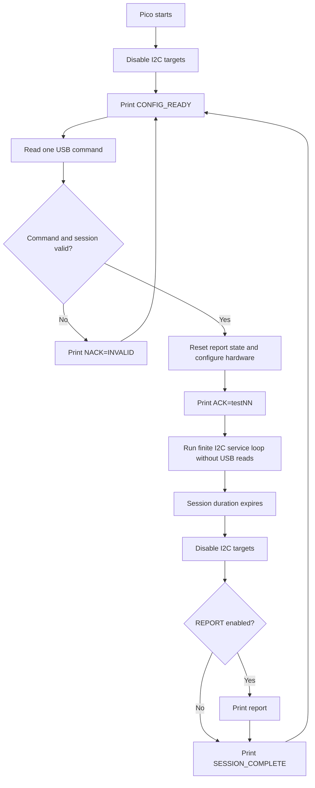

# UHF/AIS Antenna Deployment Simulator

`uhfAntSim.py` runs on a Raspberry Pi Pico using MicroPython. The Pico acts as
an I2C target and emulates the status/command register used by the UHF and AIS
antenna deployment boards.

A test is selected over the Pico micro-USB connection with one short ASCII
command such as `test01` or `test12`. The Pico configures the complete session,
acknowledges it, runs I2C without polling USB, disables I2C when the session
expires, prints the optional report, and waits for the next command.

## Hardware interfaces

| Function | Pico peripheral | Pico pins | Main address | Redundant address |
|---|---:|---|---:|---:|
| UHF target | I2C0 | SDA GP20, SCL GP21 | `0x45` | `0x46` |
| AIS target | I2C1 | SDA GP26, SCL GP27 | `0x47` | `0x48` |
| Antenna power input | GPIO | GP15 | N/A | N/A |
| Session control/report | USB CDC/REPL | Pico micro-USB | N/A | N/A |

Connect the Pico and OBC grounds together. The OBC controls the I2C clock; the
target is intended for a 100 kHz bus. External I2C pull-ups are preferred for
reliable bench operation, although `INTERNAL_PULLUPS` can enable the Pico's
weak internal pull-ups.

## USB session protocol

The Pico disables both I2C target blocks at startup and prints:

```text
CONFIG_READY
```

Send one case-insensitive ASCII test command followed by a newline:

```text
test12\n
```

After validating the command and configuring the associated I2C address or
addresses, the Pico prints:

```text
ACK=test12
```

The laptop may start the OBC/HIL test only after receiving the ACK. During the
active session the Pico does not read USB input. At the end it disables I2C,
prints the report when `REPORT = True`, then prints:

```text
SESSION_COMPLETE
CONFIG_READY
```

Invalid, empty, or oversized commands produce:

```text
NACK=INVALID
CONFIG_READY
```

Example laptop write using pyserial:

```python
pico.write(b"test12\n")

while True:
    response = pico.readline().decode(errors="replace").strip()
    if response == "ACK=test12":
        # Start the OBC/HIL test here.
        break
    if response == "NACK=INVALID":
        raise RuntimeError("Pico rejected the test command")
```

The serial baud setting is nominal for USB CDC, but the laptop should use a
consistent configuration and ensure no IDE or serial monitor already owns the
port.

## Configuration

These source settings apply to every short command:

```python
BOARD_PROFILE = "UHF"                 # "UHF" or "AIS"
DEFAULT_SESSION_DURATION_S = 200
DUAL_ADDRESS = True
TC_REQUIRES_POWER = True

TC1_DEPLOY_DELAY_S = 5
TC2_DEPLOY_DELAY_S = 5

REPORT = True
```

`ACTIVE_SCENARIO` is used only as the fallback when
`USB_SCENARIO_CONTROL = False`. With USB control enabled, the short command
selects the scenario. Its delays and address set come from `SCENARIOS`.

Important behavior:

- `BOARD_PROFILE` selects the board shown in the report and prevents AIS from
  using a power-on deployment scenario.
- `DEFAULT_SESSION_DURATION_S` ends the session even when `REPORT = False`.
- `DUAL_ADDRESS = True` normally creates independent UHF and AIS targets.
- `TC_REQUIRES_POWER = True` requires GP15 antenna power before a cutter can
  deploy its pair.
- Deployment timers reset if their required condition disappears early.
- Report history and deployment state are reset for every new session.
- The bench-only I2C command `0x80` resets deployment state during a session.

## Session lifecycle



Unexpected hardware or runtime failures disable any created targets and print
`RUNTIME_ERROR reason=...` before returning to `CONFIG_READY`.

## Antenna register

The simulator exposes one 8-bit register. There is no register-pointer byte:
an OBC write is the command byte and an OBC read returns current status.

| Bit | Name | Direction | Meaning |
|---:|---|---|---|
| 0 | FB1 | Pico to OBC | ANT1: `0` deployed, `1` stored |
| 1 | FB2 | Pico to OBC | ANT2: `0` deployed, `1` stored |
| 2 | FB3 | Pico to OBC | ANT3: `0` deployed, `1` stored |
| 3 | FB4 | Pico to OBC | ANT4: `0` deployed, `1` stored |
| 4 | TC1 | OBC to Pico/status | `1` means TC1 commanded |
| 5 | TC2 | OBC to Pico/status | `1` means TC2 commanded |
| 6 | Unused | — | Always `0` |
| 7 | Signature | Pico to OBC | `1` when `READ_SIGNATURE = True` |

Common writes are `0x00` for cutters off, `0x10` for TC1, `0x20` for TC2,
`0x30` for both cutters, and the bench-only reset command `0x80`.

With `READ_SIGNATURE = True`, common responses include:

| Response | Feedback state | Cutter state |
|---:|---|---|
| `0x8F` | All four antennas stored | Both off |
| `0x9F` | All four antennas stored | TC1 on |
| `0x9C` | ANT1/ANT2 deployed | TC1 on |
| `0xAC` | ANT1/ANT2 deployed | TC2 on |
| `0xA3` | ANT3/ANT4 deployed | TC2 on |
| `0xA0` | All four antennas deployed | TC2 on |

## Test commands and scenarios

`Pair 1` means ANT1/ANT2 (TC1). `Pair 2` means ANT3/ANT4 (TC2). The report uses
the full internal scenario name even though the laptop selects it by short ID.

| USB command | Internal scenario | Address set | Behavior |
|---|---|---|---|
| `test01` | `test01_power_on` | Main | Power deploys all antennas |
| `test02` | `test02_sequential_deploy` | Main | TC1 deploys Pair 1, then TC2 deploys Pair 2 |
| `test03` | `test03_no_deploy` | Main | No deployment |
| `test04` | `test04__power_no_deploy_then_only_tc1` | Main | Only TC1 is accepted and deploys Pair 1 |
| `test05` | `test05_power_no_deploy_then_only_tc2` | Main | Only TC2 is accepted and deploys Pair 2 |
| `test06` | `test06_power_tc1_then_tc2_deploy` | Main | Power deploys Pair 1; TC2 deploys Pair 2 |
| `test07` | `test07_power_tc1_then_tc2_no_deploy` | Main | Power deploys Pair 1; TC2 is accepted without deployment |
| `test08` | `test08_power_tc2_then_tc1_deploy` | Main | Power deploys Pair 2; TC1 deploys Pair 1 |
| `test09` | `test09_power_tc2_then_tc1_no_deploy` | Main | Power deploys Pair 2; TC1 is accepted without deployment |
| `test10` | `test10_power_tc2_deploy_then_tc1_at_red` | Redundant | Power deploys Pair 2; redundant TC1 deploys Pair 1 |
| `test11` | `test11_power_tc1_deploy_then_tc2_at_red` | Redundant | Power deploys Pair 1; redundant TC2 deploys Pair 2 |
| `test12` | `test12_redundant_tc1_tc2_deploy` | Redundant | Redundant TC1 then TC2 deployment |
| `test13` | `test13_redundant_tc1_only_tc2_ignored` | Redundant | TC1 deploys Pair 1; TC2 has no deployment effect |
| `test14` | `test14_redundant_tc1_ignored_tc2_deploy` | Redundant | TC1 rejected; TC2 deploys Pair 2 |
| `test15` | `test15_redundant_ignore_all` | Redundant | Both cutter commands rejected |
| `test16` | `redundant_deploy` | Redundant | Normal sequential behavior on redundant addresses |
| `test17` | `shared_i2c_deployment` | Shared | UHF and AIS ignore power-only deployment and require TC1 then TC2; I2C0 hands off from `0x45` to `0x47` |

Main sessions expose UHF `0x45` and AIS `0x47`. Redundant sessions expose UHF
`0x46` and AIS `0x48`.

### AIS-only scenarios

The same simulator also accepts `ais01` through `ais16` for AIS-focused runs.
These commands reuse the corresponding scenario behavior above, select the AIS
target in the GDS event stream, and expose only one AIS controller address on
Pico I²C0 (main `0x47` for `ais01`–`ais09` and redundant `0x48` for
`ais10`–`ais16`). `ais17` is intentionally not defined because `test17` already
covers the shared-I²C UHF-to-AIS handoff. The AIS runner defaults the HIL
`obc_di` control pin to GP26; override it with `--test-flight-pin` if the bench
wiring differs.

Example:

```bash
python3 tools/uhfAntDeploymentSim/run_uhf_hil_test.py \
  --ais02 \
  --pico-port /dev/ttyACM6 \
  --gds-tty /dev/piersight-hil/inspace-obc-pico-hil-1/obc-gds-uart \
  --tts-port 50050
```

## Shared-I2C behavior

`test17` uses only Pico I2C0 on GP20/GP21. It begins as UHF at `0x45`. The Pico
does not deploy UHF from power alone: TC1 must deploy ANT1/ANT2 and TC2 must
then deploy ANT3/ANT4. It keeps `0x45` until the OBC reads the final UHF
deployed status, waits the configured handoff guard interval, and changes the
same hardware block to AIS at `0x47`. AIS starts with all antennas stored and
also requires TC1 followed by TC2; power alone does not deploy it. The harness
must route both OBC transactions to this physical bus; the simulator cannot
bridge separate buses.

## Report behavior

When `REPORT = True`, the simulator records bounded command and response
histories during the session. Once the session duration expires, it first
disables every I2C target and then prints the report over USB. The report:

1. Uses the full internal scenario name.
2. Filters normal-session output using `BOARD_PROFILE`.
3. Prints separate UHF and AIS command, response, and final-result sections for
   shared `test17` sessions.
4. Compresses repeated identical responses and includes their read count.
5. Uses the last status byte actually returned to each board as its final result.

Set `REPORT = False` to disable collection and printing. The finite session
still ends after `DEFAULT_SESSION_DURATION_S`.

## Running through the OBC HIL controller

Copy `uhfAntSim.py` to the Pico as `main.py`, then run the host-side HIL
controller from this `obc_fsw` checkout. Select one scenario with `--01`
through `--17`:

```bash
cd /home/fsw-test/FSW/obc_fsw
python3 tools/uhfAntDeploymentSim/run_uhf_hil_test.py \
  --01 \
  --pico-port /dev/ttyACM6 \
  --gds-tty /dev/piersight-hil/inspace-obc-pico-hil-1/obc-gds-uart \
  --tts-port 50050 \
  --xds-tty /dev/hidraw4
```

The runner sends `test01\r\n` to the Pico at 115200 baud, requires
`ACK=test01`, starts the HIL `gds` wrapper (which configures and launches
F Prime GDS), connects an F Prime
`IntegrationTestAPI` client, sets `obc_di` pin 16 high, verifies its readback,
then flashes and boots the OBC and waits for the decoded UHF
`AntennaDeploymentStatusEvent`. It always returns pin 16 low before exiting.
Logs are written below `build-artifacts/uhf-ant-sim/`.

Skip OBC flashing and boot when the required image is already running:

```bash
python3 tools/uhfAntDeploymentSim/run_uhf_hil_test.py \
  --02 \
  --pico-port /dev/ttyACM6 \
  --gds-tty /dev/piersight-hil/inspace-obc-pico-hil-1/obc-gds-uart \
  --tts-port 50050 \
  --no-boot
```

Use `--pico-port` to select the Pico USB serial device and `--gds-tty` to
select the OBC GDS UART. The default Pico baud is 115200; GDS transport settings
are resolved by the HIL wrapper. Use `--bootloader`, `--app-image`, and `--metadata` to override
the default images under
`build-artifacts/TMS570/OBC_FSW_Deployments_OBC/bin/`.

## Bench checks

- Confirm pull-ups, voltage levels, common ground, GP15 polarity, and 100 kHz
  master clocking on physical hardware.
- Confirm the laptop waits for `CONFIG_READY` before sending a command and for
  `ACK=testNN` before starting the OBC test.
- Keep Thonny, VS Code serial monitors, and other processes off the Pico serial
  port while the controller owns it.
- A full 200-second no-timeout validation requires the Pico and OBC/HIL bench.
