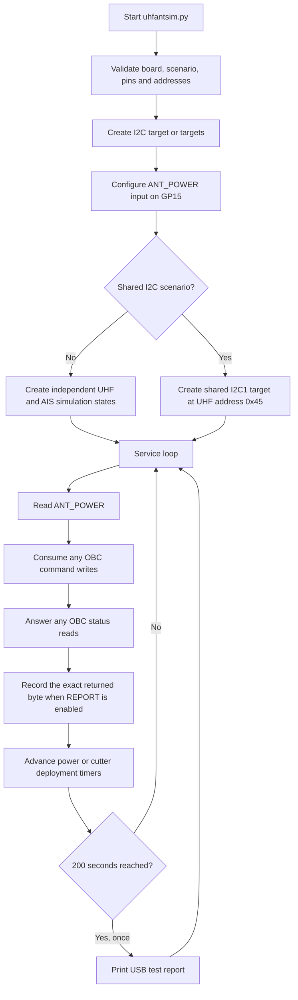
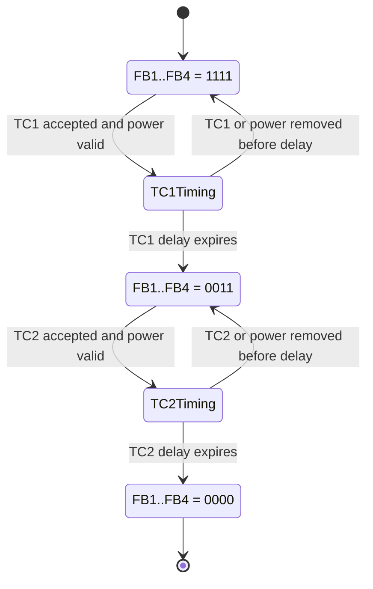
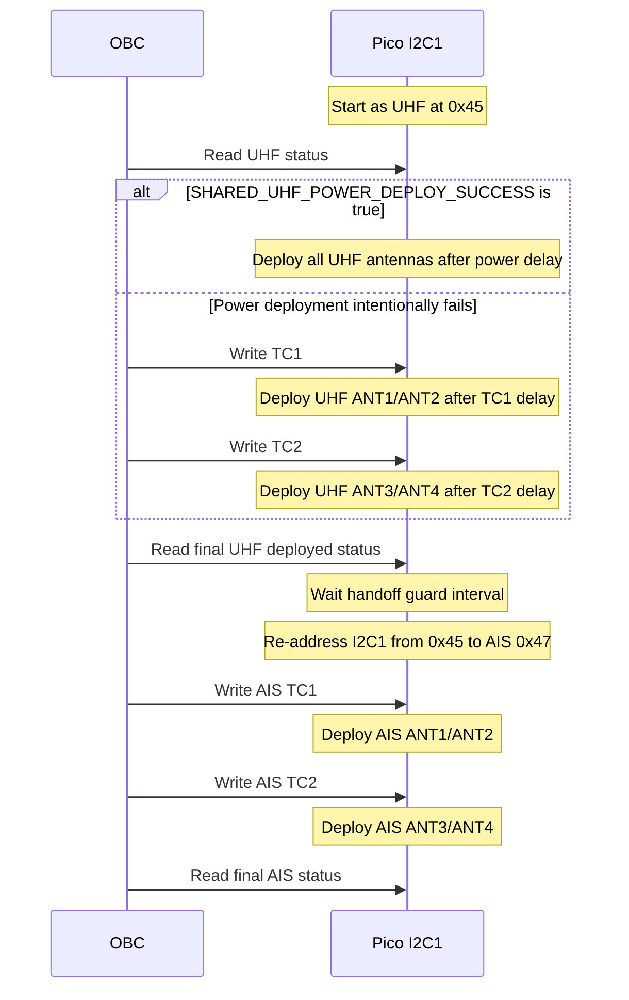

# UHF/AIS Antenna Deployment Simulator

`uhfantsim.py` runs on a Raspberry Pi Pico using MicroPython. The Pico acts as
an I2C target and emulates the status/command register used by the UHF and AIS
antenna deployment boards.

The simulator does not initiate an OBC test by itself. `ACTIVE_SCENARIO`
selects how the Pico will react; the OBC or HIL test must still apply antenna
power, write TC1/TC2 commands, and read the returned status register.

## Hardware interfaces

| Function | Pico peripheral | Pico pins | Main address | Redundant address |
|---|---:|---|---:|---:|
| UHF target | I2C0 | SDA GP20, SCL GP21 | `0x45` | `0x46` |
| AIS target | I2C1 | SDA GP26, SCL GP27 | `0x47` | `0x48` |
| Antenna power input | GPIO | GP15 | N/A | N/A |
| Test report/debug output | USB CDC/REPL | Pico micro-USB | N/A | N/A |

Connect the Pico and OBC grounds together. The OBC controls the I2C clock; the
target is intended for a 100 kHz bus. `INTERNAL_PULLUPS` can enable the Pico's
weak internal pull-ups, but external I2C pull-ups are preferred for reliable
bench operation.

## Antenna register

The simulator exposes one 8-bit register. There is no register-pointer byte:
an OBC write is the command byte and an OBC read returns the current status.

| Bit | Name | Direction | Meaning |
|---:|---|---|---|
| 0 | FB1 | Pico to OBC | ANT1: `0` deployed, `1` stored |
| 1 | FB2 | Pico to OBC | ANT2: `0` deployed, `1` stored |
| 2 | FB3 | Pico to OBC | ANT3: `0` deployed, `1` stored |
| 3 | FB4 | Pico to OBC | ANT4: `0` deployed, `1` stored |
| 4 | TC1 | OBC to Pico/status | `1` means TC1 commanded |
| 5 | TC2 | OBC to Pico/status | `1` means TC2 commanded |
| 6 | Unused | — | Always `0` |
| 7 | Signature | Pico to OBC | `1` when `READ_SIGNATURE = True` |

Common commands are:

| OBC write | Meaning |
|---:|---|
| `0x00` | TC1 and TC2 off |
| `0x10` | TC1 on |
| `0x20` | TC2 on |
| `0x30` | TC1 and TC2 on; supported by the register but not a separate scenario |
| `0x80` | Bench-only simulator reset |

With `READ_SIGNATURE = True`, common responses include:

| Response | Feedback state | Cutter state |
|---:|---|---|
| `0x8F` | All four antennas stored | Both off |
| `0x9F` | All four antennas stored | TC1 on |
| `0x9C` | ANT1/ANT2 deployed | TC1 on |
| `0xAC` | ANT1/ANT2 deployed | TC2 on |
| `0xA3` | ANT3/ANT4 deployed | TC2 on |
| `0xA0` | All four antennas deployed | TC2 on |

The complete response byte is important: bits 0–3 describe deployment while
bits 4–5 show the last accepted cutter command.

## Configuration

Edit the configuration block near the top of `uhfantsim.py` before copying or
running it on the Pico.

```python
BOARD_PROFILE = "UHF"                 # "UHF" or "AIS"
ACTIVE_SCENARIO = "test02_sequential_deploy"
DUAL_ADDRESS = True
TC_REQUIRES_POWER = True

TC1_DEPLOY_DELAY_S = 5
TC2_DEPLOY_DELAY_S = 5

REPORT = True
REPORT_AFTER_S = 200
```

Important behavior:

- `ACTIVE_SCENARIO` selects exactly one simulator behavior at startup.
- `BOARD_PROFILE` selects the board shown in the final report. It also rejects
  `POWER_ON_ALL` for AIS.
- `DUAL_ADDRESS = True` creates both UHF and AIS targets. AIS requires this in
  normal scenarios because AIS is hosted on the secondary I2C block.
- `TC_REQUIRES_POWER = True` prevents cutter deployment unless GP15 indicates
  antenna power is present.
- Cutter timers restart if their required condition disappears before the
  configured delay expires.
- Deployment feedback is permanent until the simulator is restarted or the
  bench-only `0x80` reset command is received.

## Overall execution flow



The loop is intentionally non-blocking. `POLL_MS = 0` uses a busy loop to keep
I2C response latency low. The only planned longer output operation is the
one-time USB report.

## Sequential TC deployment flow

`SEQUENTIAL_TC` is the normal TC1-then-TC2 behavior. The simulator does not
send commands; it waits for the OBC to send them.



In the active-low feedback notation above, `0011` means ANT1/ANT2 are deployed
and ANT3/ANT4 remain stored.

## Shared I2C deployment flow

`shared_i2c_deployment` uses only Pico I2C1 on GP26/GP27. The physical harness
must route both OBC transactions to this same bus.



The Pico stays at the UHF address until the OBC has actually read the final UHF
deployed response. This avoids removing `0x45` before the decisive read.

## Test scenarios

`Pair 1` means ANT1/ANT2 (TC1). `Pair 2` means ANT3/ANT4 (TC2). Status examples
assume `READ_SIGNATURE = True` and the indicated cutter command remains set.

| Scenario | Address set | Power-on behavior | TC1 behavior | TC2 behavior | Expected result / typical status |
|---|---|---|---|---|---|
| `test01_power_on` | Main | Deploy all after 5 s | Not required | Not required | All deployed; typically `0x80` |
| `test02_sequential_deploy` | Main | No direct deployment | Accept; deploy Pair 1 | Accept after Pair 1; deploy Pair 2 | `0x8F` → `0x9C` → `0xA0` |
| `test03_no_deploy` | Main | Ignore | Command may latch; no deployment | Command may latch; no deployment | All feedback remains stored; low nibble stays `0xF` |
| `test04_tc1_only` | Main | None | Accept; deploy Pair 1 | Reject | Pair 1 only; `0x9C` after TC1 |
| `test05_tc2_only` | Main | None | Reject | Accept; deploy Pair 2 | Pair 2 only; `0xA3` after TC2 |
| `test06_power_tc1_then_tc2_deploy` | Main | Deploy Pair 1 | Accepted but does not trigger deployment | Accept; deploy Pair 2 | Power gives `0x8C`; TC2 completes at `0xA0` |
| `test07_power_tc1_then_tc2_no_deploy` | Main | Deploy Pair 1 | Accepted but does not trigger deployment | Accept; deliberately no deployment | Pair 1 only; `0xAC` after TC2 |
| `test08_power_tc2_then_tc1_deploy` | Main | Deploy Pair 2 | Accept; deploy Pair 1 | Accepted but does not trigger deployment | Power gives `0x83`; TC1 completes at `0x90` |
| `test09_power_tc2_then_tc1_no_deploy` | Main | Deploy Pair 2 | Accept; deliberately no deployment | Accepted but does not trigger deployment | Pair 2 only; `0x93` after TC1 |
| `test10_power_no_deploy_then_tc1` | Main | No deployment | Accept; deploy Pair 1 | Reject | `0x8F` → `0x9C` |
| `test11_power_no_deploy_then_tc2` | Main | No deployment | Reject | Accept; deploy Pair 2 | `0x8F` → `0xA3` |
| `test12_redundant_tc1_tc2_deploy` | Redundant | No direct deployment | Accept; deploy Pair 1 | Accept after Pair 1; deploy Pair 2 | UHF `0x46`, AIS `0x48`; `0x8F` → `0x9C` → `0xA0` |
| `test13_redundant_tc1_only_tc2_ignored` | Redundant | None | Accept; deploy Pair 1 | Accept and latch; deliberately no deployment | Pair 1 only; `0xAC` after TC2 |
| `test14_redundant_tc1_ignored_tc2_deploy` | Redundant | None | Reject | Accept; deploy Pair 2 | TC1 leaves `0x8F`; TC2 produces `0xA3` |
| `test15_redundant_ignore_all` | Redundant | Ignore | Reject | Reject | All stored; `0x8F` |
| `redundant_deploy` | Redundant | No direct deployment | Accept; deploy Pair 1 | Accept after Pair 1; deploy Pair 2 | Same deployment engine as test12 |
| `shared_i2c_deployment` | Shared I2C1 | UHF power success or intentional fallback | Sequential for fallback UHF, then AIS | Sequential for fallback UHF, then AIS | UHF `0x45`, handoff, then AIS `0x47` |

Tests 04 and 10 intentionally produce the same final pair state, as do tests 05
and 11. They remain separate scenario names so the intended OBC test path is
clear when selecting and reporting a case.

## Report flow

When `REPORT = True`, the simulator:

1. Records OBC writes with time, board, address, value, and decoded command.
2. Records the exact `reg` byte passed to `send_byte()` for each OBC read.
3. Compresses repeated identical responses and keeps their total read count.
4. After `REPORT_AFTER_S`, prints one report over Pico USB CDC/REPL.
5. Filters the displayed commands and responses using `BOARD_PROFILE`.
6. Uses the last status byte actually read by the OBC as the final result. It
   does not assemble a new status byte solely for reporting.

Set `REPORT = False` to disable collection and the timed report. Debug output
is controlled separately by `DEBUG`, `DEBUG_READS`, and `DEBUG_COUNTS`.

## Running a scenario

1. Select `BOARD_PROFILE` and `ACTIVE_SCENARIO`.
2. Confirm main/redundant address selection and Pico wiring.
3. Confirm deployment delays and `TC_REQUIRES_POWER`.
4. Set `REPORT` and `REPORT_AFTER_S` as needed.
5. Copy/run `uhfantsim.py` with MicroPython on the Pico.
6. Open the Pico USB serial port on the laptop if report output is required.
7. Start the OBC/HIL test and keep GP15 at the required antenna-power level.

## Limitations and bench checks

- The RP2040 hardware supports one target address per I2C block. Main and
  redundant addresses cannot be active simultaneously on the same block.
- `shared_i2c_deployment` changes one I2C block's address; it does not bridge
  two electrically separate buses.
- USB `print()` is synchronous. The report is intentionally delayed and kept
  concise, but printing briefly pauses the polling loop.
- Verify the final setup on the physical Pico/OBC bench, including pull-ups,
  voltage levels, power polarity, I2C timing, and USB report capture.

