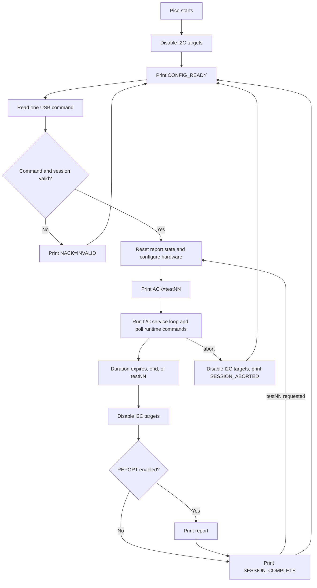

# UHF/AIS Antenna Deployment Simulator

`uhfantsim.py` runs on a Raspberry Pi Pico using MicroPython. The Pico acts as
an I2C target and emulates the status/command register used by the UHF and AIS
antenna deployment boards.

A test is selected over the Pico micro-USB connection with one short ASCII
command such as `test01` or `test12`. The Pico configures the complete session,
acknowledges it, runs I2C while accepting optional runtime commands over USB,
disables I2C when the session expires or is ended, prints the optional
report, and waits for the next command.

## Hardware interfaces

| Function | Pico peripheral | Pico pins | Main address | Redundant address |
|---|---:|---|---:|---:|
| UHF target (`testNN`) | I2C0 | SDA GP20, SCL GP21 | `0x45` | `0x46` |
| AIS target (`aisNN`, after the `test17`/`test18` handoff) | I2C0 | SDA GP20, SCL GP21 | `0x47` | `0x48` |
| Antenna power input (through a voltage divider) | GPIO | GP15 | N/A | N/A |
| Session control/report | USB CDC/REPL | Pico micro-USB | N/A | N/A |

Every session exposes one target on Pico I2C0; I2C1 is never enabled. A
session uses either one address for its whole duration or re-addresses I2C0
mid-session on an idle bus (failover and shared-bus tests).

Connect the Pico and OBC grounds together. The OBC controls the I2C clock; the
target is intended for a 100 kHz bus. External I2C pull-ups are preferred for
reliable bench operation, although `INTERNAL_PULLUPS` can enable the Pico's
weak internal pull-ups.

GP15 senses antenna power. It is active high with the Pico's internal
pull-down enabled, so an unconnected pin reads as power off. The antenna power
signal reaches GP15 through a voltage divider; Pico GPIOs are 3.3 V and not
5 V tolerant, so never connect a 5 V signal to it directly.

Install the simulator once as the Pico's `main.py`, so it starts on every boot:

```bash
mpremote connect /dev/ttyACMx cp uhfantsim.py :main.py + reset
```

## USB session protocol

The Pico disables both I2C target blocks at startup and prints:

```text
CONFIG_READY
```

Send one case-insensitive ASCII test command followed by a newline:

```text
test12\n
```

The full form is:

```text
testNN [duration_s|none] [tc_delay_s] [power_delay_s]
```

Every field after the test ID is optional and positional. `-` keeps a field's
default, so a later field can be set without the earlier ones.

| Field | Meaning | Default |
|---|---|---|
| `duration_s` | Session length in seconds; `none` runs until a runtime `end` or `abort` | `DEFAULT_SESSION_DURATION_S` (400 s) |
| `tc_delay_s` | How long a cutter must stay commanded before its antennas deploy. One value covers every cutter: UHF TC1 and TC2, and AIS TC1 (including the AIS half of `test17`/`test18`) | `TC1_DEPLOY_DELAY_S`, `TC2_DEPLOY_DELAY_S`, `AIS_TC1_DEPLOY_DELAY_S` (5 s each) |
| `power_delay_s` | How long antenna power must stay present before a power-only deployment (`test01`, `test06`–`test11`) | `PAIR_POWER_DEPLOY_DELAY_S` (5 s) |

| Command | Effect |
|---|---|
| `test12` | 400 s, default delays |
| `test12 500` | 500 s, default delays |
| `test12 none` | Until `end` or `abort`, default delays |
| `test12 600 20` | 600 s, every cutter needs 20 s |
| `test01 none 50 100` | Until `end`/`abort`, TC delay 50 s, power deploys after 100 s |
| `test01 - - 100` | Default duration and TC delay, power deploys after 100 s |

A delay is a whole number of seconds from 0 to `MAX_SESSION_DURATION_S`. A
delay that the scenario never uses (for example a power delay with `test02`) is
accepted and has no effect. Terminate the command with `\r\n` or `\n`; a lone
`\r` ends a runtime command but not a command sent at `CONFIG_READY`.

Choose delays against the OBC's own timeouts. The OBC waits about 100 s for a
power-only deployment and about 100 s for each cutter command, so a delay at or
above 100 s, or one close to it, changes which path the OBC takes (for example
`test01 none 50 100` races the OBC's power-only wait). A cutter delay also only
counts while the OBC keeps that cutter commanded; if the OBC clears the TC bit
before the delay has elapsed, the timer restarts and the pair never deploys. A
delay longer than the session duration never deploys.

The duration must be a whole number from 1 to `MAX_SESSION_DURATION_S`
(500000 s, about 5.8 days, the range MicroPython's millisecond tick arithmetic
handles correctly). A `none` session keeps serving I2C indefinitely, but
elapsed times in `status` and the report wrap after about 6.2 days.

After validating the command and configuring the associated I2C address or
addresses, the Pico prints the ACK with the test ID only (no duration):

```text
ACK=test12
```

The laptop may start the OBC/HIL test only after receiving the ACK. During the
active session the Pico accepts the runtime commands described below. At the
end it disables I2C, prints the report when `REPORT = True`, then a one-line
JSON summary and the completion lines:

```text
RESULT {"test": "test12", "outcome": "complete", "verdict": null, ...}
SESSION_COMPLETE
CONFIG_READY
```

See [Session result line](#session-result-line) for the `RESULT` fields.

Send `status` at `CONFIG_READY` to check that the Pico is alive without
starting a session. It replies with one JSON line and keeps waiting for a test
command (no `NACK`, no new `CONFIG_READY`):

```text
STATUS {"state": "idle", "power": 0}
```

`power` is the GP15 antenna-power input (`1` on, `0` off, `null` if the pin
could not be read). During a session `status` replies `RT_STATUS ...` instead
(see [Runtime commands](#runtime-commands)).

Blank lines are ignored. Invalid or oversized commands produce:

```text
NACK=INVALID
CONFIG_READY
```

Example laptop write using pyserial:

```python
pico.write(b"test12\n")

while True:
    response = pico.readline().decode(errors="replace").strip()
    if response == "ACK=test12":
        # Start the OBC/HIL test here.
        break
    if response == "NACK=INVALID":
        raise RuntimeError("Pico rejected the test command")
```

### Runtime commands

While a session is running (`RUNTIME_COMMANDS = True`), send one of these
newline-terminated, case-insensitive commands:

| Command | Effect | Reply |
|---|---|---|
| `status` | One-line snapshot: elapsed time, session duration, power input, worst loop pass, and per target the address, register, sequence phase, deployed flag, and read/write counts (`*` marks the active target) | `RT_STATUS ...` |
| `end` | Ends the session now: I2C disabled, report, `SESSION_COMPLETE`, `CONFIG_READY` | `RT_ACK=end` |
| `abort` | Ends the session now without a report: I2C disabled, `RESULT` (outcome `aborted`), `SESSION_ABORTED`, `CONFIG_READY` | `RT_ACK=abort` |
| `testNN ...` / `aisNN ...` | Ends the current session like `end`, then starts the new test directly with `ACK=testNN` and no `CONFIG_READY` in between; the duration and delays work as they do at `CONFIG_READY` | `RT_ACK=testNN ...` |

Unknown or invalid commands reply `RT_NACK=<command>` and the session keeps
running. A command still waiting to run, or only partly received, when the
session duration expires is not executed; the Pico prints
`RT_DROPPED=<command>` after disabling I2C and before the report. Runtime
replies all start with `RT_`, so a host that waits for `ACK=`/`SESSION_COMPLETE`
is not affected.

USB input never blocks I2C servicing. stdin is polled without waiting, one
character per loop pass. A completed command runs right after the next status
read the Pico serves (the OBC reads about once per second, so the bus is then
idle), or after `RUNTIME_COMMAND_DEFER_MS` (1.2 s) if no read arrives. The
full report is only printed after I2C is disabled (`end`, `testNN`, or the
duration expiring). Check `loop_max_us` in `status` against the OBC's I2C
timeout.

The serial baud setting is nominal for USB CDC, but the laptop should use a
consistent configuration and ensure no IDE or serial monitor already owns the
port.

## Configuration

These source settings apply to every short command:

```python
DEFAULT_SESSION_DURATION_S = 400     # overridden by the command's duration
TC_REQUIRES_POWER = True

TC1_DEPLOY_DELAY_S = 5                # UHF; overridden by the command's tc_delay_s
TC2_DEPLOY_DELAY_S = 5                # UHF; overridden by the command's tc_delay_s
PAIR_POWER_DEPLOY_DELAY_S = 5         # overridden by the command's power_delay_s

AIS_TC1_DEPLOY_MASK = 0x0F            # antenna bits 0-3 that AIS TC1 deploys
AIS_TC1_DEPLOY_DELAY_S = 5            # AIS TC1 burn time (TBD); overridden by tc_delay_s
AIS_PARTIAL_DEPLOY_MASK = 0x03        # used only by ais05

REPORT = True
```

`ACTIVE_SCENARIO` is used only as the fallback when
`USB_SCENARIO_CONTROL = False`. With USB control enabled, the short command
selects the scenario. Its delays and address set come from `SCENARIOS`.

Important behavior:

- The command prefix selects the board: `testNN` is UHF (or the shared
  UHF→AIS handoff) and `aisNN` is AIS. A UHF scenario cannot run as AIS and
  vice versa.
- `AIS_TC1_DEPLOY_MASK` must match the AIS success check in the OBC firmware.
  Today's AISMgr treats AIS as deployed only when bits 0-3 are all `0`, so keep
  `0x0F` unless the AIS firmware checks fewer bits. A mask of `0` or one with
  bits outside 0-3 is rejected when a session starts.
- `AIS_PARTIAL_DEPLOY_MASK` (ais05 only) must leave at least one bit of
  `AIS_TC1_DEPLOY_MASK` stored; a value that would fully deploy AIS is rejected
  when the session starts.
- Each AIS scenario is checked when its session starts: a test expecting full
  deployment must clear every bit of `AIS_TC1_DEPLOY_MASK`, a switch to
  redundant requires main to ignore TC1, and the `expect` block must be
  complete. A bad scenario answers `NACK=INVALID` instead of running.
- The session duration (default, per-command, or `none`) applies even when
  `REPORT = False`.
- `TC_REQUIRES_POWER = True` requires GP15 antenna power before a cutter can
  deploy (UHF and AIS).
- Deployment timers reset if their required condition disappears early.
- Report history and deployment state are reset for every new session.
- The bench-only I2C command `0x80` resets deployment state during a session.

## Session lifecycle


```mermaid
flowchart TD
    A[Pico starts] --> B[Disable I2C targets]
    B --> C[Print CONFIG_READY]
    C --> D[Read one USB command]
    D --> E{Command and session valid?}
    E -- No --> F[Print NACK=INVALID]
    F --> C
    E -- Yes --> G[Reset report state and configure hardware]
    G --> H[Print ACK=testNN]
    H --> I[Run I2C service loop and poll runtime commands]
    I --> J[Duration expires, end, or testNN]
    I -- abort --> Q[Disable I2C targets, print SESSION_ABORTED]
    Q --> C
    J --> K[Disable I2C targets]
    K --> L{REPORT enabled?}
    L -- Yes --> M[Print report]
    L -- No --> N[Print SESSION_COMPLETE]
    M --> N
    N -- testNN requested --> G
    N --> C
```

Unexpected hardware or runtime failures disable any created targets and print
`RUNTIME_ERROR reason=...` before returning to `CONFIG_READY`.

## Antenna register

The simulator exposes one 8-bit register. There is no register-pointer byte:
an OBC write is the command byte and an OBC read returns current status.

| Bit | Name | Direction | Meaning |
|---:|---|---|---|
| 0 | FB1 | Pico to OBC | ANT1: `0` deployed, `1` stored |
| 1 | FB2 | Pico to OBC | ANT2: `0` deployed, `1` stored |
| 2 | FB3 | Pico to OBC | ANT3: `0` deployed, `1` stored |
| 3 | FB4 | Pico to OBC | ANT4: `0` deployed, `1` stored |
| 4 | TC1 | OBC to Pico/status | `1` means TC1 commanded |
| 5 | TC2 | OBC to Pico/status | `1` means TC2 commanded |
| 6 | Unused | — | Always `0` |
| 7 | Unused | — | Always `0` |

Common writes are `0x00` for cutters off, `0x10` for TC1, `0x20` for TC2,
`0x30` for both cutters, and the bench-only reset command `0x80`.

The AIS board uses the same register but has a single cutter. Only TC1 has an
effect: it deploys the bits in `AIS_TC1_DEPLOY_MASK`. Bit 5 (TC2) always reads
`0` on AIS, a TC2 write is ignored, and power alone never deploys AIS. With the
default mask an AIS run reads `0x0F` (all stored), `0x1F` (TC1 on), then
`0x10` (all deployed, TC1 still on).

Bits 6 and 7 (NC on the flight board) always read `0`, so common responses
include:

UHF responses:

| Response | Feedback state | Cutter state |
|---:|---|---|
| `0x0F` | All four antennas stored | Both off |
| `0x1F` | All four antennas stored | TC1 on |
| `0x1C` | ANT1/ANT2 deployed | TC1 on |
| `0x2C` | ANT1/ANT2 deployed | TC2 on |
| `0x23` | ANT3/ANT4 deployed | TC2 on |
| `0x20` | All four antennas deployed | TC2 on |

## Test commands and scenarios

`Pair 1` means ANT1/ANT2 (TC1). `Pair 2` means ANT3/ANT4 (TC2). The report uses
the full internal scenario name even though the laptop selects it by short ID.

| USB command | Internal scenario | Address set | Behavior |
|---|---|---|---|
| `test01` | `test01_power_on` | Main | Power deploys all antennas |
| `test02` | `test02_sequential_deploy` | Main | TC1 deploys Pair 1, then TC2 deploys Pair 2 |
| `test03` | `test03_no_deploy` | Main | No deployment |
| `test04` | `test04__power_no_deploy_then_only_tc1` | Main | Only TC1 is accepted and deploys Pair 1 |
| `test05` | `test05_power_no_deploy_then_only_tc2` | Main | Only TC2 is accepted and deploys Pair 2 |
| `test06` | `test06_power_tc1_then_tc2_deploy` | Main | Power deploys Pair 1; TC2 deploys Pair 2 |
| `test07` | `test07_power_tc1_then_tc2_no_deploy` | Main | Power deploys Pair 1; TC2 is accepted without deployment |
| `test08` | `test08_power_tc2_then_tc1_deploy` | Main | Power deploys Pair 2; TC1 deploys Pair 1 |
| `test09` | `test09_power_tc2_then_tc1_no_deploy` | Main | Power deploys Pair 2; TC1 is accepted without deployment |
| `test10` | `test10_power_tc2_deploy_then_tc1_at_red` | Redundant | Power deploys Pair 2; redundant TC1 deploys Pair 1 |
| `test11` | `test11_power_tc1_deploy_then_tc2_at_red` | Redundant | Power deploys Pair 1; redundant TC2 deploys Pair 2 |
| `test12` | `test12_redundant_tc1_tc2_deploy` | Redundant | Redundant TC1 then TC2 deployment |
| `test13` | `test13_redundant_tc1_only_tc2_ignored` | Redundant | TC1 deploys Pair 1; TC2 has no deployment effect |
| `test14` | `test14_redundant_tc1_ignored_tc2_deploy` | Redundant | TC1 rejected; TC2 deploys Pair 2 |
| `test15` | `test15_redundant_ignore_all` | Redundant | Both cutter commands rejected |
| `test16` | `redundant_deploy` | Redundant | Normal sequential behavior on redundant addresses |
| `test17` | `shared_i2c_deployment` | Shared (main) | UHF ignores power-only deployment and needs TC1 then TC2; I2C0 then hands off from `0x45` to AIS `0x47`, where TC1 alone deploys AIS |
| `test18` | `shared_i2c_deployment_redundant` | Shared (redundant) | Same handoff as `test17`, but both boards answer on their redundant addresses; I2C0 hands off from `0x46` to `0x48` |
| `test20` | `tc2_failover_main_to_red` | Main → redundant | TC1 deploys on `0x45`; TC2 is ACKed on `0x45` but does not deploy; I2C0 moves to `0x46` and the OBC's timed-out TC2 retry deploys ANT3/ANT4 there |
| `test21` | `main_lost_after_tc1` | Main → redundant | TC1 deploys on `0x45`; I2C0 then moves to `0x46` before TC2, so the OBC's TC2 write to main is NACKed and its next-tick retry deploys ANT3/ANT4 on `0x46` |

Main sessions expose UHF `0x45` only; redundant sessions expose UHF `0x46`
only. No AIS target is exposed during `test01`–`test16`, `test20` or `test21`.

### AIS scenarios (single cutter, TC1 only)

AIS has its own tests. They run on Pico I2C0 at the AIS addresses and follow
the TC1-only model above. The old `ais01`–`ais16`, `ais20` and `ais21` aliases
of the UHF tests are retired; `ais06` and above now answer `NACK=INVALID`.

| USB command | Internal scenario | Pico behavior | Expected OBC result |
|---|---|---|---|
| `ais01` | `ais01_tc1_main_deploy` | TC1 on `0x47` deploys | `SUCCESS`, states `1-2-3-5-6-11`, ~10 s |
| `ais02` | `ais02_tc1_main_ignored_red_deploy` | TC1 ACKed on `0x47` but ignored; I2C0 moves to `0x48`; TC1 there deploys | `SUCCESS` after the 100 s TC1 timeout, states `1-2-3-5-6-7-6-11`, ~111 s |
| `ais03` | `ais03_redundant_only_tc1_deploy` | Only `0x48` present; TC1 on main is NACKed; TC1 on `0x48` deploys | `SUCCESS`, states `1-2-3-5-7-6-11`, ~11 s |
| `ais04` | `ais04_tc1_ignored_both` | TC1 ignored on `0x47`, I2C0 moves to `0x48`, TC1 ignored there too | `ERROR_DEPLOYMENT_TIMEOUT`, states `1-2-3-5-6-7-6-12`, ~205 s |
| `ais05` | `ais05_tc1_partial_deploy` | TC1 on `0x47` deploys only `AIS_PARTIAL_DEPLOY_MASK` | Failure, ~105-112 s (see below) |

The expected results are for both the current AISMgr (which still runs a
TC1→TC2 sequence for AIS) and the expected TC1-only AIS firmware; `ais01`–`ais04`
give the same states in both. `ais05` differs: the TC1-only firmware times out
on TC1 and then fails writing TC1 to the absent redundant
(`ERROR_I2C_WRITE_TC1_FAILED`, `1-2-3-5-6-7-12`). The current firmware sees
ANT1/ANT2 deployed, sends TC2 (ignored, and flagged as a warning in the
report), times out and fails writing TC2 to redundant
(`ERROR_I2C_WRITE_TC2_FAILED`, `1-2-3-5-6-8-9-10-12`). The AIS behaviour is
provisional until the TC1-only AIS change lands in `obc_fsw`.

Each AIS report ends with an `AIS TC1-ONLY CHECK` section. It shows which bits
this scenario's TC1 clears and which bits count as deployed
(`AIS_TC1_DEPLOY_MASK`), any address switch, whether TC1 reached main and
redundant, the final antenna state, and `Scenario result: AS EXPECTED` or
`UNEXPECTED`, judged against the scenario's expected path. "Deployed" means
every bit of `AIS_TC1_DEPLOY_MASK` reads `0`, so the verdict stays correct if
that mask is changed to match the firmware. It only counts the run after the last bench `0x80` reset. Any
TC2 write that reaches AIS is reported as a `WARNING`.

The AIS runner defaults the HIL `obc_di` control pin to GP26; override it with
`--test-flight-pin` if the bench wiring differs. The runner in `obc_fsw` still
lists the old `--ais01`–`--ais16` options, so check it matches these commands
before running AIS tests through it.

Example:

```bash
python3 tools/uhfAntDeploymentSim/run_uhf_hil_test.py \
  --ais02 \
  --pico-port /dev/ttyACM6 \
  --gds-tty /dev/piersight-hil/inspace-obc-pico-hil-1/obc-gds-uart \
  --tts-port 50050
```

## Shared-I2C behavior

`test17` uses only Pico I2C0 on GP20/GP21. It begins as UHF at `0x45`. The Pico
does not deploy UHF from power alone: TC1 must deploy ANT1/ANT2 and TC2 must
then deploy ANT3/ANT4. It keeps `0x45` until the OBC reads the final UHF
deployed status, waits the configured handoff guard interval, and changes the
same hardware block to AIS at `0x47`. AIS starts with all antennas stored and
follows the TC1-only model: TC1 alone deploys it, and power alone does not.
These are happy-path tests; AIS failure cases are covered by `ais02`–`ais05`. The harness
must route both OBC transactions to this physical bus; the simulator cannot
bridge separate buses.

`test18` is identical to `test17` except both boards answer on their
redundant addresses: it begins as UHF at `0x46` and, after the same handoff
guard interval, switches the same I2C0 block to AIS at `0x48`.

## TC2 main-to-redundant failover (`test20`)

Only Pico I2C0 (GP20/GP21) is enabled; I2C1 stays off. The target starts on the
UHF main address `0x45`:

1. The OBC waits up to 100 s for a power-only deployment, which does not
   happen.
2. TC1 on main is accepted and deploys ANT1/ANT2 after `tc1_delay_s`.
3. The OBC sends TC2 to main. It is ACKed and shown in the register, but does
   not deploy.
4. Once that TC2 write has been received and the bus has stayed idle for
   `FAILOVER_SWITCH_DELAY_MS` (20 ms; reset by any transfer or by the RP2040
   slave-activity bit), the same block is re-addressed to redundant `0x46`.
   The switch arms only after the TC1 pair is deployed.
5. The OBC keeps polling about once a second; each status read fails on main
   and falls back to redundant, so it never sees a read failure on both.
6. After the OBC's 100 s TC2 timeout it re-sends TC2 to redundant, which
   deploys ANT3/ANT4 after `tc2_delay_s`, completing the deployment.

The OBC reports `SUCCESS` about 210 s after the deployment starts. If the switch never happens, the OBC's redundant TC2
write is NACKed and it reports `ERROR_I2C_WRITE_TC2_FAILED`. The report adds
an `ADDRESS FAILOVER` section listing the switch time, when TC1-on-main,
TC2-on-main and TC2-on-redundant were seen, the TC2 main→redundant gap, and a
`PASS`/`INCOMPLETE` result. Because UHF needs about 210 s plus boot, run it
with a longer session (for example `test20 600`) and a host status wait
above the 240 s default.

## Main lost after TC1 (`test21`)

This models the main controller disappearing mid-deployment. Only Pico I2C0 is
enabled, starting on the UHF main address `0x45`:

1. The OBC waits up to 100 s for a power-only deployment, which does not
   happen.
2. TC1 on main is accepted and deploys ANT1/ANT2 after `tc1_delay_s`.
3. After the Pico serves the read showing the TC1 pair deployed, and the bus
   has stayed idle for `FAILOVER_SWITCH_DELAY_MS` (20 ms), I2C0 moves to
   redundant `0x46`. The OBC's next tick is about 1 s away.
4. The OBC's TC2 write to main is NACKed, because no target holds that address,
   so the Pico never sees it.
5. On its next tick the OBC sends TC2 to redundant, which deploys ANT3/ANT4
   after `tc2_delay_s`.

OBC states: `1-2-3-4-5-6-8-10-9-11`, reaching `SUCCESS` about 111 s after the
deployment starts. The report adds a `MAIN LOST AFTER TC1` section listing the
switch time; TC1 on main, TC2 on main and TC2 on redundant; the switch to
TC2-on-redundant gap; and a `PASS`/`INCOMPLETE` result. `TC2 on main` must be
`NOT SEEN`. If it is seen, the switch was late and the run took the `test20`
timeout path instead, so the result is `INCOMPLETE` even if the OBC reports
`SUCCESS`. The verdict only counts the run after the last bench `0x80` reset.

## Report behavior

When `REPORT = True`, the simulator records bounded command and response
histories during the session. Once the session duration expires (or on a
runtime `end`/`testNN`), it first
disables every I2C target and then prints the report over USB. The report:

1. Uses the full internal scenario name.
2. Prints the UHF sections for `testNN` and the AIS sections for `aisNN`.
3. Prints separate UHF and AIS command, response, and final-result sections for
   shared `test17`/`test18` sessions. AIS sections show antennas deployed out of
   4 instead of the UHF TC1/TC2 pairs.
   `test20` also prints an `ADDRESS FAILOVER` section, `test21` a
   `MAIN LOST AFTER TC1` section, and `aisNN` an `AIS TC1-ONLY CHECK` section.
4. Compresses repeated identical responses and includes their read count.
5. Uses the last status byte actually returned to each board as its final result.

Set `REPORT = False` to disable collection and printing. The session still
ends after its duration. The report header shows the configured duration, the
actual elapsed time, and the TC and power delays in use, each marked
`(command)` or `(default)`; `n/a` means the scenario has no such deployment.

## Session result line

Every session ends with one `RESULT` line holding a JSON object, printed after
the report and before `SESSION_COMPLETE` or `SESSION_ABORTED`. Host tools read
this line instead of parsing the report:

```text
RESULT {"test": "test20", "scenario": "tc2_failover_main_to_red", "outcome": "complete", "verdict": "PASS", "duration_s": 600, "elapsed_s": 600.002, "tc_delay_s": 5, "power_delay_s": null, "obc_writes": {"UHF": 4}, "status_reads": {"UHF": 590}, "final": {"UHF": {"address": "0x46", "status": "0x20", "state": "ALL DEPLOYED", "last_read_s": 599.0}}, "address_switches": [{"t_s": 112.4, "from": "0x45", "to": "0x46", "reason": "..."}], "history_overflow": false}
```

| Field | Meaning |
|---|---|
| `test`, `scenario` | Short command and internal scenario name |
| `outcome` | `complete` (duration expired, `end`, or a runtime `testNN`) or `aborted` |
| `verdict` | `PASS`/`INCOMPLETE` for `test20`/`test21`, `AS EXPECTED`/`UNEXPECTED` for `aisNN`, otherwise `null`; always `null` when aborted |
| `duration_s` | Configured session length; `null` for `none` |
| `elapsed_s` | Actual session length |
| `tc_delay_s`, `power_delay_s` | Delays in use; `null` when the scenario has no such deployment |
| `obc_writes`, `status_reads` | Per-board OBC write and status-read counts |
| `final` | Per board, the last status byte actually returned to the OBC, with its address and decoded state. Empty when `REPORT = False` |
| `address_switches` | Every mid-session re-address of I2C0 |
| `history_overflow` | `true` when the bounded command or response history overflowed |

The OBC's pass/fail is decided by the host test, not by this line.

`RESULT` is printed for every session that ends normally or by `abort`. If the
report or the `RESULT` line itself fails to print (for example on a Pico memory
error), the Pico prints `REPORT_ERROR reason=...` or `RESULT_ERROR reason=...`
instead and still ends with `SESSION_COMPLETE` or `SESSION_ABORTED`. A failure
while the session is running prints `RUNTIME_ERROR reason=...` and then
`CONFIG_READY`, with no `RESULT`, so a host must treat `RUNTIME_ERROR` as the
end of the session too. The JSON key order can differ between runs; read it as
JSON, not by position.

## Running through the OBC HIL controller

Copy `uhfantsim.py` to the Pico as `main.py`, then run the host-side HIL
controller from this `obc_fsw` checkout. Select one scenario with `--01`
through `--17`:

```bash
cd /home/fsw-test/FSW/obc_fsw
python3 tools/uhfAntDeploymentSim/run_uhf_hil_test.py \
  --01 \
  --pico-port /dev/ttyACM6 \
  --gds-tty /dev/piersight-hil/inspace-obc-pico-hil-1/obc-gds-uart \
  --tts-port 50050 \
  --xds-tty /dev/hidraw4
```

The runner sends `test01\r\n` to the Pico at 115200 baud, requires
`ACK=test01`, starts the HIL `gds` wrapper (which configures and launches
F Prime GDS), connects an F Prime
`IntegrationTestAPI` client, sets `obc_di` pin 16 high, verifies its readback,
then flashes and boots the OBC and waits for the decoded UHF
`AntennaDeploymentStatusEvent`. It always returns pin 16 low before exiting.
Logs are written below `build-artifacts/uhf-ant-sim/`.

Skip OBC flashing and boot when the required image is already running:

```bash
python3 tools/uhfAntDeploymentSim/run_uhf_hil_test.py \
  --02 \
  --pico-port /dev/ttyACM6 \
  --gds-tty /dev/piersight-hil/inspace-obc-pico-hil-1/obc-gds-uart \
  --tts-port 50050 \
  --no-boot
```

Use `--pico-port` to select the Pico USB serial device and `--gds-tty` to
select the OBC GDS UART. The default Pico baud is 115200; GDS transport settings
are resolved by the HIL wrapper. Use `--bootloader`, `--app-image`, and `--metadata` to override
the default images under
`build-artifacts/TMS570/OBC_FSW_Deployments_OBC/bin/`.

## Bench checks

- Confirm pull-ups, voltage levels, common ground, GP15 polarity, and 100 kHz
  master clocking on physical hardware.
- Confirm the laptop waits for `CONFIG_READY` before sending a command and for
  `ACK=testNN` before starting the OBC test.
- Keep Thonny, VS Code serial monitors, and other processes off the Pico serial
  port while the controller owns it.
- A full 400-second no-timeout validation requires the Pico and OBC/HIL bench.
